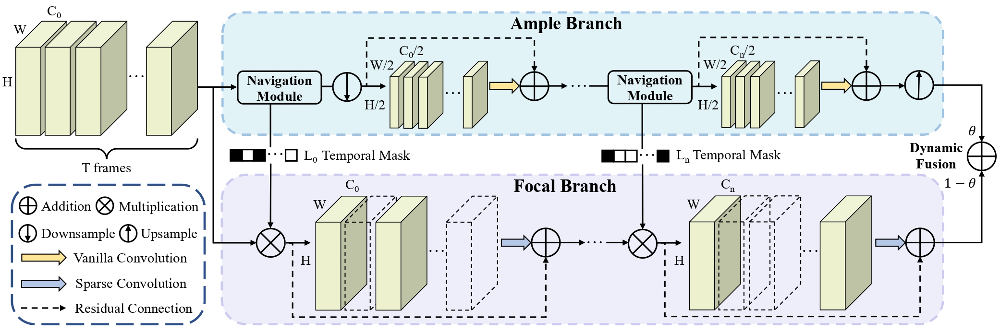

# Look More but Care Less in Video Recognition (NeurIPS 2022)

    
    

 [open review](https://openreview.net/forum?id=owZdBnUiw2) | arXiv | Primary contact: [Yitian Zhang](mailto:markcheung9248@gmail.com)

  

Architecture of AF module. The module is composed of two branches, the ample branch would process all the input features in a lower resolution and reduced channel size; while the focal branch would only compute the features of salient frames (colored features) guided by our proposed navigation module. The results of two branches are adaptively fused at the end of AF module so that we can prevent the loss of information.

## Code will be available soon. :monkey::monkey::monkey: