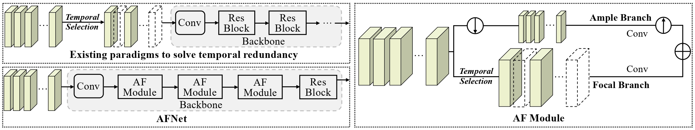

# Look More but Care Less in Video Recognition (NeurIPS 2022)

    
    

arXiv | Primary contact: [Yitian Zhang](mailto:markcheung9248@gmail.com)

  

Comparisons between existing methods and our proposed Ample and Focal Network (AFNet). Most existing works reduce the redundancy in data at the beginning of the deep networks which leads to the loss of information. We propose a two-branch design which processes frames with different computational resources within the network and preserves all input information as well.

## Code will be available soon. :monkey::monkey::monkey:
